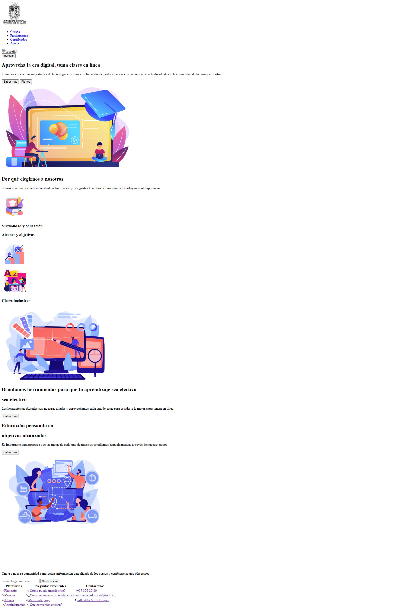
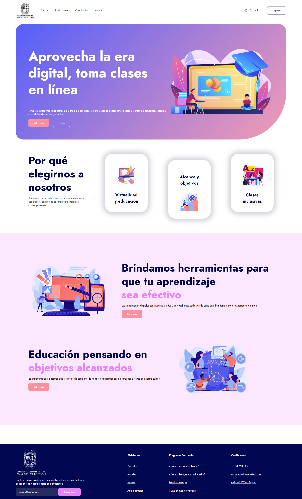
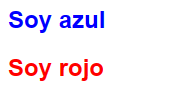
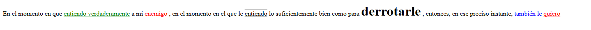
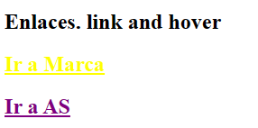
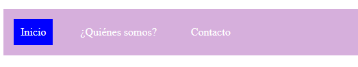
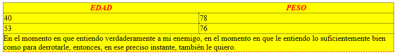

<h1>Taller 9 - Laura Andrea Rojas Crucerira</h1>

<h2>Información</h2>

Curso: Full Stack Báscio - Grupo 1

Profesor: Cristian Patiño 

<h3>Link de la página web</h3>
<a href="https://andrea-rc.github.io/taller-9-full-stack/">Link de página web</a>

<h3>Punto 1: Link de Figma</h3>
<a href="https://www.figma.com/file/cUEffecEUA4Hfvp8iXUIgv/Laura-Andrea-Rojas?type=design&node-id=0%3A1&mode=design&t=uUW8hogUnQPtfGnl-1">Link de Figma</a>

<h3>Punto 2: Diseño en HTML</h3>

<h3>Punto 3: Diseño con CSS</h3>

<h3>Punto 4: Diseño con Títulos</h3>

<h3>Punto 5: Párrafo</h3>

<h3>Punto 6: Links</h3>

<h3>Punto 7 y 8: Navegación</h3>

<h3>Punto 9: Tabla</h3>
